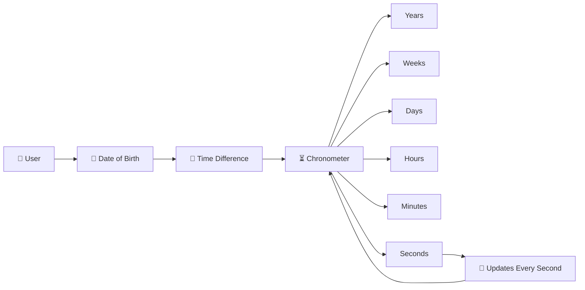
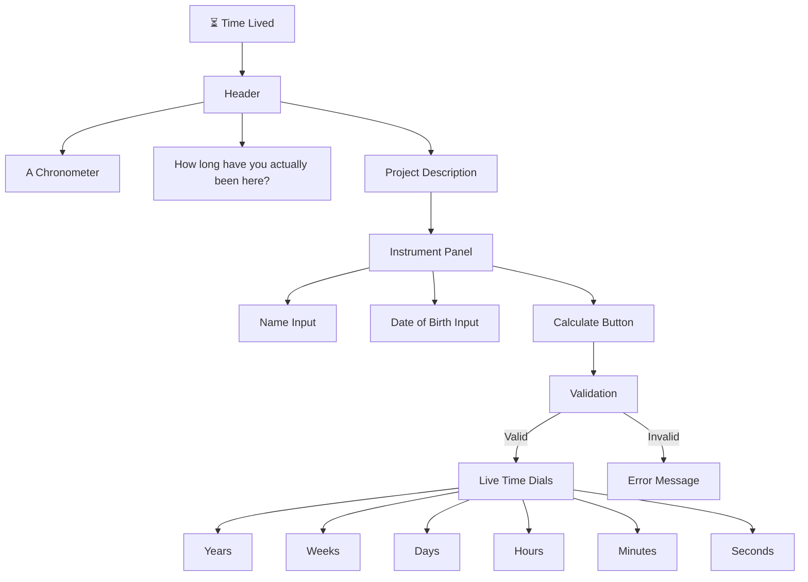
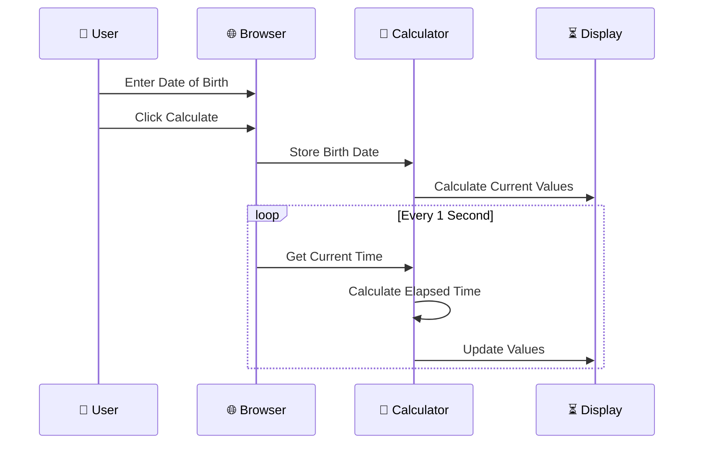
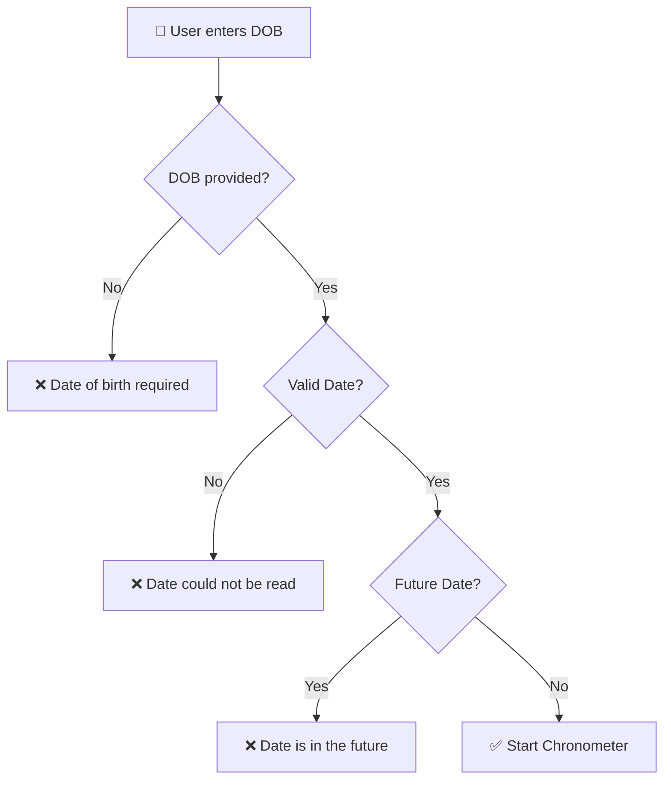
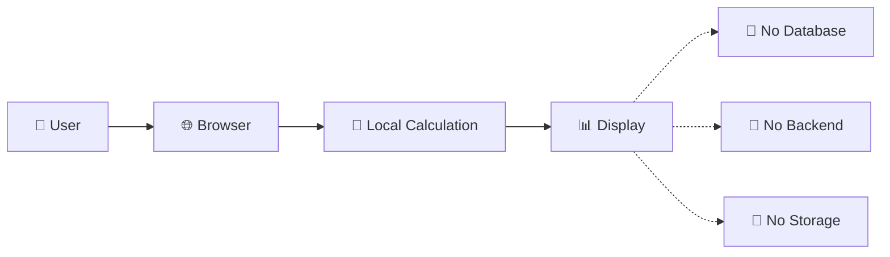
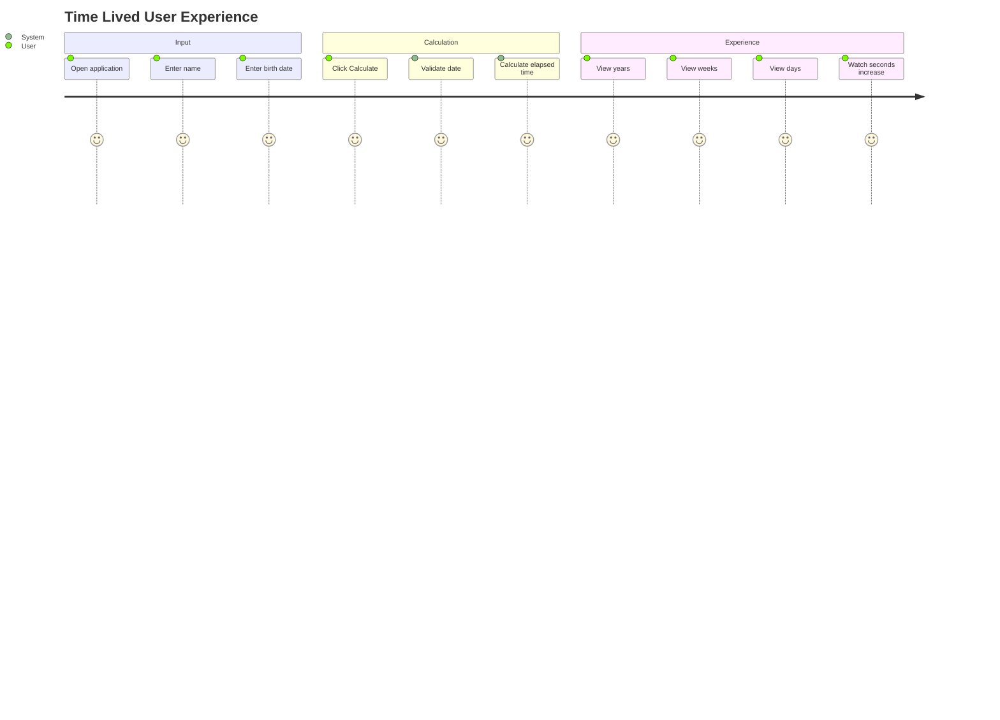

# ⏳ Time Lived

<p align="center">

# **TIME LIVED**

### *A Chronometer for a Life*

**How long have you actually been here?**

A minimal, elegant web chronometer that transforms your date of birth into a live measurement of the time you've experienced — from **years to seconds**.

</p>

<p align="center">


</p>

---

## 🌌 About The Project

**Time Lived** is a lightweight browser-based chronometer designed around one simple question:

> **How much time have you actually lived?**

Enter a name and date of birth, and the application continuously calculates:

* 📅 Years lived
* 📆 Weeks lived
* ☀️ Days lived
* ⏰ Hours lived
* ⏱️ Minutes lived
* ⚡ Seconds lived

The values update automatically every second, creating a live representation of elapsed lifetime.

All calculations happen directly inside the browser, and the application does not store the entered information.

---

# ✨ Core Idea



The application converts the elapsed time between the user's birth date and the current moment into multiple human-readable time units.

---

# 🎨 Design Philosophy

The interface follows a **vintage scientific-instrument / precision chronometer aesthetic** rather than a conventional modern dashboard.

### Visual language

| Element             | Design                    |
| ------------------- | ------------------------- |
| 🎨 Background       | Dark ink-inspired surface |
| 🟨 Accent           | Brass / antique gold      |
| 🟢 Secondary Accent | Verdigris                 |
| 🔴 Error State      | Rust                      |
| 📰 Display Font     | Fraunces                  |
| 💻 Technical Font   | IBM Plex Mono             |
| 🧩 UI Font          | Inter                     |
| 📐 Layout           | Minimal instrument panel  |
| 📱 Responsive       | Yes                       |

## The implementation defines a dark `ink` foundation with parchment, brass, verdigris and rust accents, alongside Fraunces, IBM Plex Mono and Inter typography.

# 🖥️ Interface Architecture



---

# ⚙️ How It Works

The application follows a simple client-side lifecycle:

```text
┌─────────────────────────┐
│       👤 USER           │
│                         │
│ Name + Date of Birth    │
└────────────┬────────────┘
             │
             ▼
┌─────────────────────────┐
│     🔍 VALIDATION        │
│                         │
│ Is DOB valid?            │
│ Is DOB in the future?    │
└────────────┬────────────┘
             │
             ▼
┌─────────────────────────┐
│      📅 BIRTH DATE      │
└────────────┬────────────┘
             │
             ▼
┌─────────────────────────┐
│      🧮 CALCULATION     │
│                         │
│ Current Time - DOB      │
└────────────┬────────────┘
             │
             ▼
┌─────────────────────────┐
│       ⏳ LIVE DIALS     │
│                         │
│ Years                   │
│ Weeks                   │
│ Days                    │
│ Hours                   │
│ Minutes                 │
│ Seconds                 │
└────────────┬────────────┘
             │
             ▼
        🔄 Every 1 Second
```

---

# 🧮 Calculation Engine

The core calculation begins by determining the difference between the current time and the entered birth date.

```javascript
const diffMs = now - birthDate;
```

The difference is progressively converted:

```text
Milliseconds
     ↓
Seconds
     ↓
Minutes
     ↓
Hours
     ↓
Days
     ↓
Weeks
```

Years are calculated separately based on whether the user's birthday has occurred during the current year.

---

# 🔄 Real-Time Update System

One of the key features is the continuously updating seconds counter.



The implementation starts an interval after a valid calculation and calls the `tick()` function every **1000 milliseconds**.

---

# 🛡️ Input Validation

The application includes basic validation before starting the chronometer.



The JavaScript checks for a missing date, invalid date parsing, and dates later than the current time.

---

# 📊 Time Display

Once a valid date is entered, the application reveals a grid of time dials:

```text
┌─────────────┬─────────────┬─────────────┐
│    YEARS    │    WEEKS    │    DAYS     │
│    18       │    965      │   6,756     │
└─────────────┴─────────────┴─────────────┘

┌─────────────┬─────────────┐
│    HOURS    │   MINUTES   │
│   162,144   │  9,728,640  │
└─────────────┴─────────────┘

┌─────────────────────────────────────────┐
│                 SECONDS                 │
│              583,718,400                │
└─────────────────────────────────────────┘
```

## The actual interface uses six display units, with seconds given a visually emphasized full-width dial.

# 📱 Responsive Design

The UI adapts to smaller screens.

### Desktop

```text
┌─────────────────────────────────────────────┐
│                                             │
│             TIME LIVED                      │
│                                             │
│  ┌───────────────────────────────────────┐  │
│  │ Name       DOB              Calculate │  │
│  ├───────────────────────────────────────┤  │
│  │ Years │ Weeks │ Days                  │  │
│  │ Hours │ Minutes                       │  │
│  │              Seconds                  │  │
│  └───────────────────────────────────────┘  │
│                                             │
└─────────────────────────────────────────────┘
```

### Mobile

```text
┌───────────────────────┐
│     TIME LIVED        │
│                       │
│ Name                  │
│ ┌───────────────────┐ │
│ │                   │ │
│ └───────────────────┘ │
│                       │
│ Date of Birth         │
│ ┌───────────────────┐ │
│ │                   │ │
│ └───────────────────┘ │
│                       │
│ ┌───────────────────┐ │
│ │     CALCULATE     │ │
│ └───────────────────┘ │
│                       │
│ Years │ Weeks         │
│ Days  │ Hours         │
│ Minutes               │
│       Seconds         │
└───────────────────────┘
```

The CSS switches the dial grid to two columns on smaller screens and makes the Calculate button full-width.

---

# 🔐 Privacy First

One of the strongest aspects of the project is its simplicity.



The interface explicitly states:

> **ALL VALUES CALCULATED LOCALLY IN YOUR BROWSER · NOTHING IS STORED**

No backend or database is implemented in the provided HTML.

---

# 🧰 Tech Stack

```text
┌────────────────────────────┐
│        FRONTEND            │
├────────────────────────────┤
│                            │
│  🧱 HTML5                  │
│  🎨 CSS3                   │
│  ⚡ Vanilla JavaScript     │
│                            │
├────────────────────────────┤
│        TYPOGRAPHY          │
├────────────────────────────┤
│                            │
│  Fraunces                  │
│  IBM Plex Mono             │
│  Inter                     │
│                            │
└────────────────────────────┘
```

The project is implemented as a standalone HTML document containing its CSS and JavaScript.

---

# 📁 Project Structure

```text
Time-Lived/
│
├── 📄 tl.html
└── 📄 README.md
```

A minimal architecture for a minimal idea.

---

# 🚀 Getting Started

## 1. Clone the Repository

```bash
git clone https://github.com/<your-username>/Time-Lived.git
```

## 2. Open the Project

Simply open:

```text
tl.html
```

in any modern web browser.

No:

* ❌ Backend
* ❌ Database
* ❌ Build system
* ❌ Package installation
* ❌ API key

is required.

---

# 🧪 User Journey



---

# 💡 Design Philosophy

**Time Lived** intentionally avoids the typical "modern SaaS dashboard" look.

Instead, it is designed to feel like a **precision instrument**.

```text
Modern Dashboard
      ❌
      │
      ▼
Information Overload

             ↓

Time Lived
      ✅
      │
      ▼
One Question
      ↓
One Input
      ↓
One Calculation
      ↓
One Meaningful Result
```

The visual system uses a restrained dark palette, brass highlights, technical typography and an instrument-like panel to reinforce the concept of measuring time.

---

# 🔮 Future Roadmap

Possible future extensions:

* [ ] 🌍 Multiple timezone support
* [ ] 📆 Exact age calculator
* [ ] 🎂 Next birthday countdown
* [ ] 🕰️ Lifetime percentage calculator
* [ ] 📊 Time distribution visualization
* [ ] 📱 Progressive Web App support
* [ ] 🌗 Theme switching
* [ ] 🎨 Additional chronometer themes
* [ ] 📤 Shareable lifetime statistics
* [ ] ♿ Enhanced accessibility
* [ ] 🧪 Automated testing

---

# 🎯 Project Philosophy

> **Time is the only resource you spend without knowing your balance.**

This project turns an abstract idea into something visible.

Instead of saying:

**"I'm 20 years old."**

you can see:

**How many days?
How many hours?
How many minutes?
How many seconds?**

And the counter keeps moving.

---

# ⭐ Support

If you like the concept, consider giving the repository a ⭐.

Your support helps encourage more small, thoughtful experiments with **frontend engineering, interaction design and JavaScript**.

---

<p align="center">

### ⏳ Every second counts.

**Built with HTML, CSS & JavaScript.**

</p>
